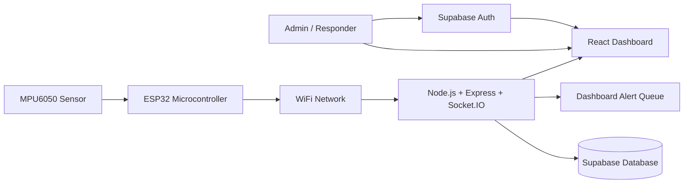

# System Architecture

## High-Level Flow

## Core Modules

- Sensor Data Acquisition: Reads MPU6050 accelerometer and gyroscope values.
- Accident Detection Logic: Computes acceleration magnitude and tilt angle.
- Severity Prediction: Converts sensor values into Level 1, Level 2, or Level 3 incidents.
- IoT Communication: Pushes JSON telemetry and heartbeat updates to the backend over HTTP.
- Backend Processing: Validates, enriches, simulates coordinates, stores, and broadcasts accident events.
- Dashboard Visualization: Displays alerts, charts, OpenStreetMap markers, device health, and monitoring views.
- Alert and Notification: Creates emergency alerts for the dashboard command queue and realtime responders.

## Production-Style Design Notes

- The backend uses a service-oriented structure to keep ingestion, alerting, and realtime updates isolated.
- Supabase handles authentication and structured persistence for users, devices, accidents, and alerts.
- Socket.IO enables the dashboard to reflect new incidents without manual refresh.
- Level 3 incidents automatically trigger dashboard alert escalation and realtime operator visibility.
- When GPS is unavailable, the backend assigns simulated coordinates so mapping requirements are still satisfied for the project.
