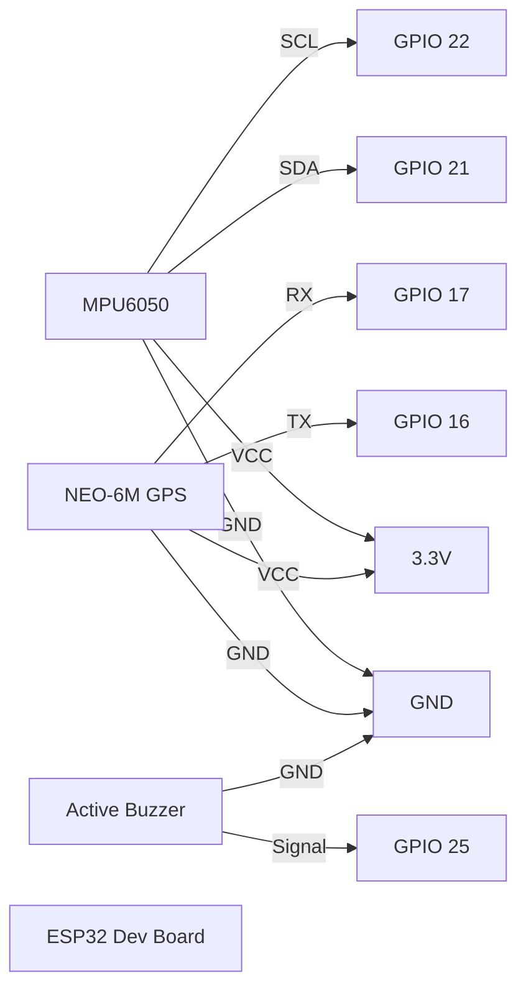

# Hardware Wiring

## Components

- ESP32 Development Board (ESP-WROOM-32)
- MPU6050 Accelerometer + Gyroscope
- NEO-6M GPS Module
- Active Buzzer
- Breadboard
- Jumper Wires
- USB Power Supply

## Wiring Table

| MPU6050 Pin | ESP32 Pin |
| --- | --- |
| VCC | 3.3V |
| GND | GND |
| SDA | GPIO 21 |
| SCL | GPIO 22 |
| INT | Optional / Not used in prototype |

| NEO-6M GPS Pin | ESP32 Pin |
| --- | --- |
| VCC | 3.3V |
| GND | GND |
| TX | GPIO 16 |
| RX | GPIO 17 |

| Active Buzzer Pin | ESP32 Pin |
| --- | --- |
| VCC / Signal | GPIO 25 |
| GND | GND |

## Wiring Diagram

## Connection Notes

- Power the MPU6050 from the ESP32 `3.3V` pin to avoid over-voltage issues.
- Connect `SDA` and `SCL` on the shared I2C bus.
- Use ESP32 `UART2` on `GPIO16` and `GPIO17` for the NEO-6M GPS module.
- The active buzzer is driven directly from `GPIO25` and sounds for severe accidents.
- Use a stable USB power source while testing to avoid noisy sensor readings.
- Mount the MPU6050 firmly on the vehicle body or prototype chassis so tilt and impact readings are meaningful.
- Place the GPS antenna where it can see the sky; indoor lock can take significantly longer.
